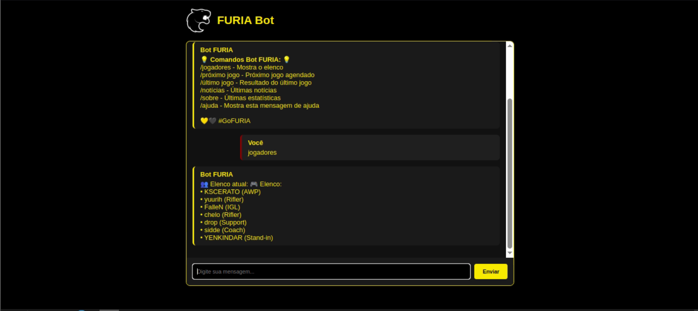
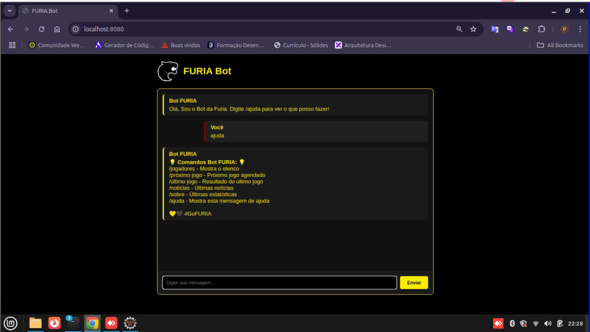

# FURIA Bot - Chat Interativo para Fãs de eSports 🎮🤖


Um bot de chat interativo para fãs da FURIA eSports, desenvolvido com Spring Boot e WebSocket, que fornece informações sobre jogadores, partidas e notícias do time.

## ✨ Funcionalidades Principais

- **Chat em tempo real** via WebSocket
- **Comandos especializados** para fãs de CS2:
  - 👥 Listagem do elenco atual
  - ⚡ Próximos jogos agendados
  - 🔥 Resultados dos últimos jogos
  - 📰 Links de notícias e redes sociais
  - ℹ️ Estatísticas sobre o time
- **Interface responsiva** com tema oficial da FURIA
- **Sistema de reconexão automática** em caso de falhas

## 🛠️ Tecnologias Utilizadas

### Backend (Java/Spring)
- **Spring Boot 3.x** - Framework principal
- **Spring WebSocket** - Comunicação em tempo real
- **STOMP** - Protocolo de mensagens
- **SockJS** - Fallback para navegadores antigos
- **SLF4J** - Logging

### Frontend
- **HTML5** + **CSS3** - Interface do chat
- **JavaScript** - Lógica do cliente
- **SockJS-client** - Conexão WebSocket
- **STOMP.js** - Gerenciamento de mensagens

## 🚀 Como Executar o Projeto

### Pré-requisitos
- Java JDK 17+
- Maven 3.8+
- Navegador moderno (Chrome, Firefox, Edge)

### Instalação
1. Clone o repositório:
   ```bash
   git clone https://github.com/seu-usuario/furia-bot.git
   cd furia-bot
   ```

2. Construa o projeto
    ```
    mvn clean package
    ```

3. Execute a aplicação
    ```
    java -jar target/furia-bot-1.0.0.jar
    ```

4. Acesse no navegador
    ```
    http://localhost:8080
    ```

## 📚 Estrutura do Projeto

 ```
        furia-bot/
        ├── src/
        │   ├── main/
        │   │   ├── java/br/com/pedroqho/furiabot/
        │   │   │   ├── controller/        # Controladores Spring
        │   │   │   │   └── ChatController.java
        │   │   │   ├── model/             # Modelos e serviços
        │   │   │   │   ├── service/
        │   │   │   │   │   └── MockDataService.java
        │   │   │   │   └── ChatMessage.java
        │   │   ├── resources/
        │   │   │   ├── static/            # Recursos estáticos
        │   │   │   │   └── furia-logo.png
        │   │   │   ├── templates/         # Views HTML
        │   │   │   │   └── index.html
        │   │   │   └── application.properties
        ├── pom.xml                        # Dependências Maven
```

## 💡 Exemplos de Uso

  1. Consultar elenco atual:
      ```
            /jogadores
        ``

  

       Resposta:
        ```
            🎮 Elenco:
            • KSCERATO (AWP)
            • yuurih (Rifler)
            • FalleN (IGL)
            • chelo (Rifler)
            • drop (Support)
        ```
    
  2. Próximo jogo:
        ```
            /proximo jogo
        ```
  

        
        ```
  Resposta:
    ```
    ⚡ Próximo jogo: 
    FURIA vs NAVI - 20/05 - ESL Pro League
		PGL ASTANA 2025 - 10/05/25 à 18/05/25
		IEM Dallas 2025 - 19/05/25 à 25/05/2025
        ```

  3. Ajuda:
     ```
     /ajuda
     ```

  


  Mostra todos os comandos disponíveis


## 🌐 Configuração de Deployment
Para implantar em produção:

  1. Configure o application.properties:
     ```
        server.port=8080
        spring.thymeleaf.cache=false # Desativar em dev
     ```
  2. Recomenda-se usar:

     ```
     - Nginx como proxy reverso

     - PM2 ou systemd para gerenciamento do processo Java

     - HTTPS com certificado válido
     ```

## 🤝 Contribuição
Contribuições são bem-vindas! Siga estes passos:

1. Faça um fork do projeto

2. Crie uma branch para sua feature (git checkout -b feature/nova-feature)

3. Commit suas mudanças (git commit -m 'Adiciona nova feature')

4. Push para a branch (git push origin feature/nova-feature)

5. Abra um Pull Request

